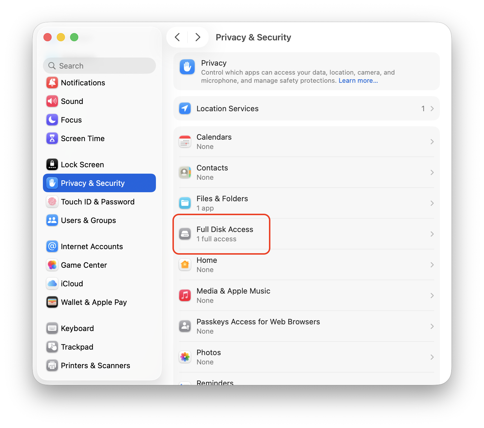
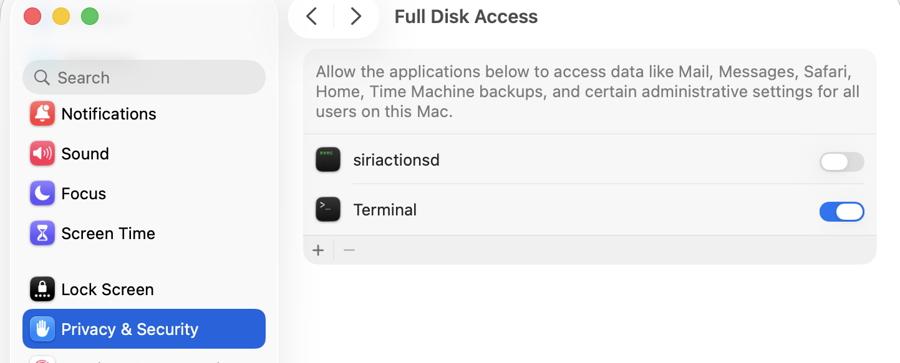

# apple-message-forensics

**Apple Messages Forensics** is an open-source DFIR and eDiscovery tool for collecting and preserving Apple Messages data from macOS, extracting messages and attachments to structured JSON, and generating human-readable HTML reports for counsel and investigators. It is designed specifically for the Apple Messages ecosystem and does not support Android, WhatsApp, Signal, or other third-party messaging platforms.

This project was inspired by the Python project [imessagedb](https://pypi.org/project/imessagedb/). This project is written in Rust and has a few key differences.

* Focused on Forensics
    * Collects all artifacts for preservation
    * MD5 & SHA hashes
* Dumps the whole dataset instead of 1 handle at a time
* Scoped reporting
    * Filter on date range
    * Filter on sender

## Scope and Limitations

### Purpose

The original purpose of this tool is for collecting Apple Messages data made available on macOS through Messages/iCloud synchronization for eDiscovery.

### Requirements

You need a MacBook that is not controlled by your enterprise IT and log in with the target Apple Apple Account credentials.

Logging in with the Apple account on the MacBook will trigger 2-factor authentication on the target phone.

In order to collect messages from the iPhone via your MacBook, you will need to enable syncing on the phone.

Here is the [Apple support page](https://support.apple.com/guide/icloud/set-up-messages-mm0de0d4528d/icloud) for enabling syncing to iCloud.

In order to capture SMS text messages as well as iMessages, you must enable text message forwarding.

Here is the walkthrough on the [Apple support page](https://support.apple.com/en-us/102545).

You will either need 

* the phone and unlock info for the phone
* walk the custodian through setting up iCloud sync with text message forwarding and approve the 2-factor login

Here are the advantages of using iCloud sync over traditional cellphone forensics:

### Disadvantage of traditional forensic tools

* Built for criminal cases and overkill for simply collecting messages for litigation
* You need physical access to the phone
* Your MDM solution must not block device pairing
* Cost in terms of time, money, and proprietary support, training, and specialized equipment
* The custodian will be without their phone while you process it
* Device can be lost or damaged in the mail
* Must preserve chain of custody
* Slow and manual process
* Forensic analyst must be trained on a complicated tool set and process
* Does not scale if undergoing an MDM migration or processing a large case or geographically dispersed case

### Advantages of collecting via iCloud sync

* Can be done remotely if custodian cooperates with 2-factor auth and provides Apple credentials
* Custodian can still work on their phone while analyst collects data, only interruption is 2-factor auth
* Cheap - no specialized tooling and licenses
* Fast - done in minutes instead of hours/days
* Easy - no training from proprietary vendor, you just need to know how to work the command line
* Scales across a large enterprise with a small forensic team

### Limitations

All of these are both pros and cons, but you should be aware of them.

* Very narrow scope
* Open source - this is a simple tool you can inspect and testify to its inner workings, but there is no Service Level Agreement
* 2-Factor auth - If a custodian suddenly passes away or refuses to co-operate with their custodial duties, you won't be able to log in to the iCloud
  * Some MDM solutions allow you to reset the password to the phone, but that is separate from the iCloud login

## Prerequisite Access

You need to grant **Full Disk Access** to the application from which you run the tool.
On macOS, even when using `sudo` commands, you are by default blocked from accessing the library folders.

You must explicitly grant access to the application running the tool.

1. Go to **System Settings → Privacy & Security → Full Disk Access** 
2. Enable access for terminal 

## Install

Go to the [releases page](https://github.com/McFlip/apple-message-forensics/releases) and download the correct binary depending on if you are running Apple silicon or Intel.

If you don't know what you are running under the hood use the following command

```bash
sysctl -n machdep.cpu.brand_string | grep -qi 'Apple' && echo "Apple silicon" || echo "Intel CPU"
```

On macOS, once you have the binary:

1. Download and extract the macOS binary `apple-message-forensics`
2. Open Terminal in the directory containing the binary
3. Make it executable (if necessary):

```bash
chmod +x apple-message-forensics
```

4. Run the binary directly:

```bash
./apple-message-forensics [command-options-here]
```

### Make runnable from anywhere on macOS

To run the command from any directory (not just where you downloaded it), place the binary in a known location like `~/bin` and ensure that directory is in your PATH.

If you don't have a `~/bin` directory yet, create it:

```bash
mkdir -p ~/bin
```

Then move or copy the binary into `~/bin` (and make it executable if needed):

```bash
mv /path/to/your/apple-message-forensics ~/bin/apple-message-forensics
chmod +x ~/bin/apple-message-forensics
```

### Add the bin folder to your $PATH

For the current terminal session, run:

```bash
export PATH="$HOME/bin:$PATH"
```

For a permanent setting (add to your shell config file, e.g., ~/.zshrc or ~/.bashrc):

```bash
echo 'export PATH="$HOME/bin:$PATH"' >> ~/.zshrc   # or ~/.bashrc
```

Now you can run it from anywhere on the system simply by:

```bash
./bin/apple-message-forensics [command-options-here]
```

No need to cd to the original location — just use the path in your bin directory.

## Usage

>[!Note] All available source files are collected into the evidence ZIP. All messages are dumped to JSON.

Filtering can be applied to report generation.

You can filter by

* Date Range
* Contact

### Collect Everything and Generate Report

This is the default with no subcommands or options.

Without specifying the output directory, all output goes into the present working directory.

```bash
apple-message-forensics
```

Output looks like the following:

#### Folder Layout (example for a completed case)

```
caseName/
  delivery/                     # ZIP of everything else and hash of deliverable
  evidence/                     # ZIP files collected with hashes (txt)
  json/                         # Output of SQL queries for further analysis
  report/                       # HTML human-readable report for delivery
```

### Pass Metadata to the Report

You can create a text document in YAML format for including analyst and case data.
It will be copied into the header of the report.

```bash
apple-message-forensics --meta "path/to/metadata-file"
```

#### Example Metadata

```YAML
case:
  name: "Acme Corp Investigation"
  number: "CASE-2026-0042"
  requestor: "Jane Smith"
  notes: |
    Forensic examination of the provided iMessage database.
    Analysis limited to messages and attachments present in the acquired database.

analyst:
  name: "John Doe"
  organization: "Example Digital Forensics"
  contact: "john.doe@example.com"

custodian:
  name: "Jane Smith"
  device_name: "Jane's iPhone serial # abcd123"

report:
  title: "iMessage Forensic Examination Report"
  date: "2026-10-02"
```

### Specify Output Directory

```bash
apple-message-forensics --outdir "path/to/output"
```

>[!Warning] The command will fail if the output directory is not empty, unless you are running the `report` subcommand

### Collection Only - Do not generate report

```bash
apple-message-forensics collect
```

`json` output will still be generated, but no report.

### Run a Report on Existing Collection

```bash
apple-message-forensics report
```

Reports will be in a subfolder named by timestamp in the format `yyyy-mm-dd-HH-mm-ss`.
Running multiple reports will add a new report to the `reports` subfolder and not overwrite any existing report.

### Specify Date Range

You can filter date ranges for the report.
All data is collected every time, so these switches have no effect on the `collect` subcommand.

```bash
apple-message-forensics --start "yyyy-mm-dd" --end "yyyy-mm-dd"
```

If you only specify

1. start only - This means from this day forward
2. end only   - This means up to this day
3. both       - This means in between

All dates are inclusive.

### Specify Contact

You can filter by contact(s) for the report.
All data is collected every time, so these switches have no effect on the `collect` subcommand.

Messages are not linked to contacts, but `handles`.

Handle
: A phone # or email address associated with this chat

A contact can have multiple handles, so we filter by contacts not handles to get all messages for a person.

1. To find a contact first run a [collection](#collection-only---do-not-generate-report).
2. Search the file `contacts.json` for the `contact_id`.
3. Run a [report](#run-a-report-on-existing-collection) but specify contacts in a comma-separated list.

```bash
apple-message-forensics report --filter-contacts "1,2,3"
```

### Combined filters

You can combine date range and contact filters

```bash
apple-message-forensics --start "2026-01-01" --end "2026-01-31" --filter-contacts "1,2,3"
```

### Deliver

This creates a ZIP archive with everything included (except previous deliveries) and optionally password-protects the ZIP.
A text file with matching name will have the hashes of the deliverable.

Passwords will be entered in a prompt and no characters will be echoed to the screen.
You will be prompted for the password twice.

You can also specify a different destination if you don't want to use the default `delivery` subfolder.

```bash
apple-message-forensics deliver --password --destination "path/to/destination"
```

If you need more advanced packaging capabilities, such as chunking to a maximum size or delivering only the report,
I highly recommend the 3rd party tool `7zip`. You can find it [here](https://www.7-zip.org).

## Report Format

The report is a self-contained local website consisting of the following

* Header
  * timestamp in UTC and local time
  * tool version
  * filter settings used on command line
  * metadata table rendered from file passed in on the command line
  * basic stats
    * total messages
    * earliest message
    * latest message
    * top talkers
* List of list pages
  * Contacts sorted alphabetically
  * Contacts sorted by most recent message
  * Chats sorted alphabetically
  * Chats sorted by most recent message
  * All messages sorted by most recent - paged
  
* Clicking on a contact link will display a list of available chats.
* Chats show messages in a thread format

## How it Works

You never know when you might get called to the witness stand, so you should know the data lineage.

### Apple Messages Syncing

When Messages in iCloud is enabled, the Mac maintains a local copy of the Messages data associated with the Apple Account. This tool does not collect messages directly from Apple's iCloud services. Instead, it collects the local artifacts that macOS creates and maintains after the Messages data has been synchronized to the Mac.

This means the completeness of the collection depends on what has actually synchronized to the Mac at the time of acquisition. The Mac should be allowed to complete its Messages synchronization before collection begins.

> [!Warning] This tool does not create a forensic image of the iPhone. It collects and preserves Apple Messages artifacts that are available on the Mac at the time of acquisition.

The tool requires access to the custodian's macOS user profile and therefore requires **Full Disk Access** for the application running the tool. The collection is performed from the local filesystem rather than through an Apple API or cloud service.

### Chat Database

The primary source of message data is the SQLite database:

`~/Library/Messages/chat.db`

The database contains the message, chat, participant handle, and attachment metadata used to reconstruct conversations. The relationships between these records are represented by join tables such as `chat_message_join`, `chat_handle_join`, and `message_attachment_join`. The actual attachment files are also collected from the Messages data directory.

`chat.db` is a live SQLite database and may be accompanied by two SQLite sidecar files:

* `chat.db-wal` — the SQLite write-ahead log containing transactions that have not yet been checkpointed into the main database.
* `chat.db-shm` — the SQLite shared-memory file used to coordinate access to the WAL.

For forensic collection, these files should be treated as part of the same database artifact. **Do not collect only `chat.db` when `chat.db-wal` or `chat.db-shm` are present.** Recent database activity may exist in the WAL rather than in the main database, and collecting only the main database can therefore result in an incomplete acquisition.

The tool collects the database and its associated files into the evidence package before performing analysis. The original source files are preserved and hashed as part of the collection.

### Address Book

The `handle` records in `chat.db` identify participants primarily by identifiers such as telephone numbers and email addresses. The human-readable name displayed for a participant is not necessarily stored in `chat.db`; macOS may resolve that identifier through the Contacts/AddressBook data maintained on the Mac.

For this reason, the address book is a separate evidence source and should be collected along with the Messages database.

macOS can maintain multiple address-book sources, including local contacts and contacts synchronized from configured accounts. **Collect all available AddressBook/Contacts data for the custodian rather than selecting a single address book or source.** This allows the report to resolve as many message handles as possible to the names available in the collected address-book data.

If a handle cannot be resolved through the collected address-book data, the report will retain the original phone number or email address rather than treating the contact as unknown.

### Evidence Model

The collection workflow preserves the source artifacts used for acquisition and analysis and then produces derived outputs for analysis and reporting.

```text
Source artifacts
  ├── Messages database
  │     ├── chat.db
  │     ├── chat.db-wal
  │     └── chat.db-shm
  │
  ├── Messages attachments
  │
  └── AddressBook / Contacts

        ↓

Evidence package
        ↓
    JSON extraction
        ↓
    HTML report
        ↓
     Delivery ZIP
```

The evidence package is the preserved source material. JSON files and HTML reports are derived outputs that can be used for further analysis and review.

### SQL Queries

Check the reference section of this repository to see the Schema of the source databases that were referenced while building this tool.

All SQL queries used by the tool are also provided so that you can independently verify them with your favorite SQLite tools.

I used `sqlite-utils` for inspecting test data on my development system, which is an Apple M5 MacBook Air on macOS Golden Gate `v27.0`.

### Validating hashes

I use SHA256 for hashes.

Here's how to use a hashfile on macOS or Linux:

```bash
sha256sum -c hashes.txt
```

And here is how to do it in PowerShell7 on Windows or any other platform running PowerShell7:

First, create a PowerShell script named `Validate-Manifest.ps1`.

```powershell
[CmdletBinding()]
param(
    [Parameter(Mandatory)]
    [string]$Manifest
)

$ErrorActionPreference = 'Stop'

$manifestPath = (Resolve-Path -LiteralPath $Manifest).Path
$baseDir = Split-Path -Parent $manifestPath

$failed = 0
$checked = 0

foreach ($line in Get-Content -LiteralPath $manifestPath) {
    # Skip blank lines
    if ([string]::IsNullOrWhiteSpace($line)) {
        continue
    }

    # sha256sum format:
    # <64-character SHA256>  <relative path>
    # Also accepts the binary-mode form with a leading '*'.
    if ($line -notmatch '^([0-9a-fA-F]{64})\s+[* ](.+)$') {
        Write-Warning "Invalid manifest line: $line"
        $failed++
        continue
    }

    $expectedHash = $Matches[1].ToUpperInvariant()
    $relativePath = $Matches[2]

    $filePath = Join-Path -Path $baseDir -ChildPath $relativePath

    if (-not (Test-Path -LiteralPath $filePath -PathType Leaf)) {
        Write-Host "FAILED  $relativePath (file not found)"
        $failed++
        continue
    }

    $actualHash = (Get-FileHash -LiteralPath $filePath -Algorithm SHA256).Hash

    $checked++

    if ($actualHash -eq $expectedHash) {
        Write-Host "OK      $relativePath"
    }
    else {
        Write-Host "FAILED  $relativePath"
        Write-Host "        Expected: $expectedHash"
        Write-Host "        Actual:   $actualHash"
        $failed++
    }
}

Write-Host ""
Write-Host "Checked: $checked"
Write-Host "Failed:  $failed"

if ($failed -gt 0) {
    exit 1
}

exit 0
```

Run the script and pass the directory of the manifest file

```powershell
.\Validate-Manifest.ps1 .\SHA256SUMS
```

## Issues

This is an open-source tool provided as-is. However, if you report an issue on this repo, I will do my best to help.

Let me know what OS version you are running and version of this tool.

If you can reproduce the issue with test data please provide that.

>[!Warning] Do not send me sensitive case data or anything classified. This is not a War Thunder forum!